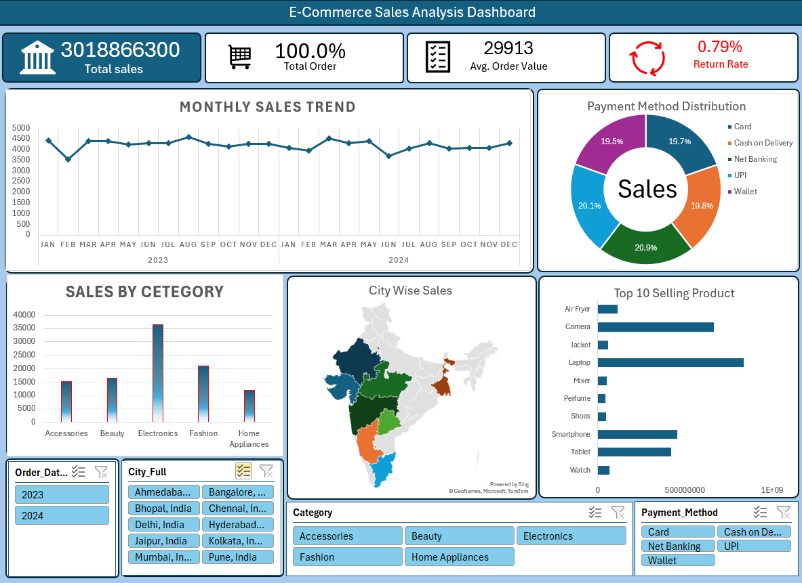

# E-Commerce Sales Analysis Dashboard

This project presents an interactive E-Commerce Sales Dashboard built using Microsoft Excel.

##  Key Features:
-  Monthly Sales Trend Analysis
-  Total Orders and Sales Overview
-  Average Order Value Calculation
-  Return Rate Analysis
-  Category-wise Sales Breakdown
-  City-wise Sales Visualization
-  Payment Method Distribution
-  Top 10 Best-Selling Products

##  Tools Used:
- Microsoft Excel
- Pivot Tables
- Charts
- Slicers
- Data Cleaning

##  Dashboard Preview:

- 

🔗 This project demonstrates strong skills in data analysis and dashboard creation using Excel.
